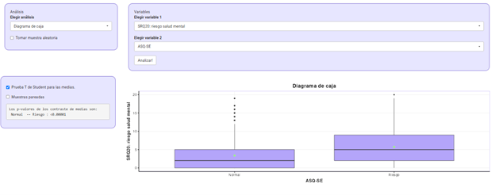

## Pruebas t

### Lectura asociada

Capítulo

### Contenidos

-   Tipos de pruebas t: una muestra, dos muestras independientes, muestras pareadas

-   Estadístico t, interpretación del valor p y decisión (rechazar o no la Hipótesis nula)

-   Reporte

## Familia de pruebas t

Como observaste en los videos y capítulo de libro asignado para esta semana, existen distintos tipos de pruebas t

1.  Recupera los tres tipos distintos de Prueba t

<strong>¿Necesitas ayuda?</strong>

Recuerda que las posibilidades son: Prueba t para una muestra, muestras independientes o pareadas.

2.  Identifica, para cada uno de los estudios que se mencionan a continuación, qué tipo de Prueba t aplicarías:

-   Comparar el valor de ansiedad promedio de una muestra de estudiantes universitarios de Psicología con un valor conocido.

-   Comparar los niveles de ansiedad antes de un tratamiento en dos grupos de participantes distintos.

-   Evaluar el nivel de  ansiedad previa y post intervención en un mismo grupo de participantes.

3.  Piensa en otros ejemplos de estudios en el campo de la Psicología en los que sería adecuado aplicar Pruebas t

## Ejercicio en el Panel (ejemplo)

Queremos comparar si existen diferencias estadísticamente significativas en los niveles de riesgo en salud mental de adultos responsables de niños categorizados con y sin riesgo en su desarrollo socioemocional a partir del instrumento CBCL.  

-   La base ENDIS nos ofrece datos para realizar este análisis. 

<!-- -->

-   Diagrama de caja \> seleccionar variable 1 \> seleccionar variable 2 

<!-- -->

-   ¿Qué Prueba t estás utilizando en este caso? Justifica

-   Observa los diagramas de cajas. Desarrolla intuiciones respecto al resultado.

-   Ahora activa el casillero Prueba t de Student para las medias. Considera si debes activar o no el casillero Muestras pareadas en este ejemplo.

-   Interpreta y reporta en forma escrita el resultado. Por ejemplo:

“Se realizó una prueba t (especificar tipo de prueba t) para comparar \_\_\_\_\_\_\_\_\_\_\_\_ entre \_\_\_\_\_\_\_\_ y  \_\_\_\_\_\_\_\_ . Los resultados mostraron que la diferencia entre grupos (fue / no fue) estadísticamente significativa, t(gl) = valor t, p = valor p. En conjunto, estos resultados sugieren que (interpretación breve).”

## Ejercicio en el Panel (a incluir en el Entregable)

1.  Vamos a aplicar Pruebas t en el marco del trabajo trabajo entregable. Recupera el template del entregable (archivo Word) y localiza el apartado correspondiente a Prueba t.

2.  Ingresa al Panel de análisis, selecciona la base de datos que corresponda en tu subgrupo. 

3.  Formula la pregunta y la hipótesis, verifica que sean compatibles con el análisis mediante Prueba t. 

4.  Junto con la posibilidad de realizar Pruebas t, el panel te ofrece información en forma gráfica. ¿Qué tipo de gráfico se muestra? Evalúa tus hipótesis y desarrolla intuiciones acerca del resultado a partir del gráfico.

5.  Ahora activa el casillero Prueba t y valora si corresponde o no activar el casillero Muestras pareadas. Interpreta el resultado (estadístico t, p valor).

6.  ¿Cómo reportarías ese resultado en forma escrita en tu informe? 
